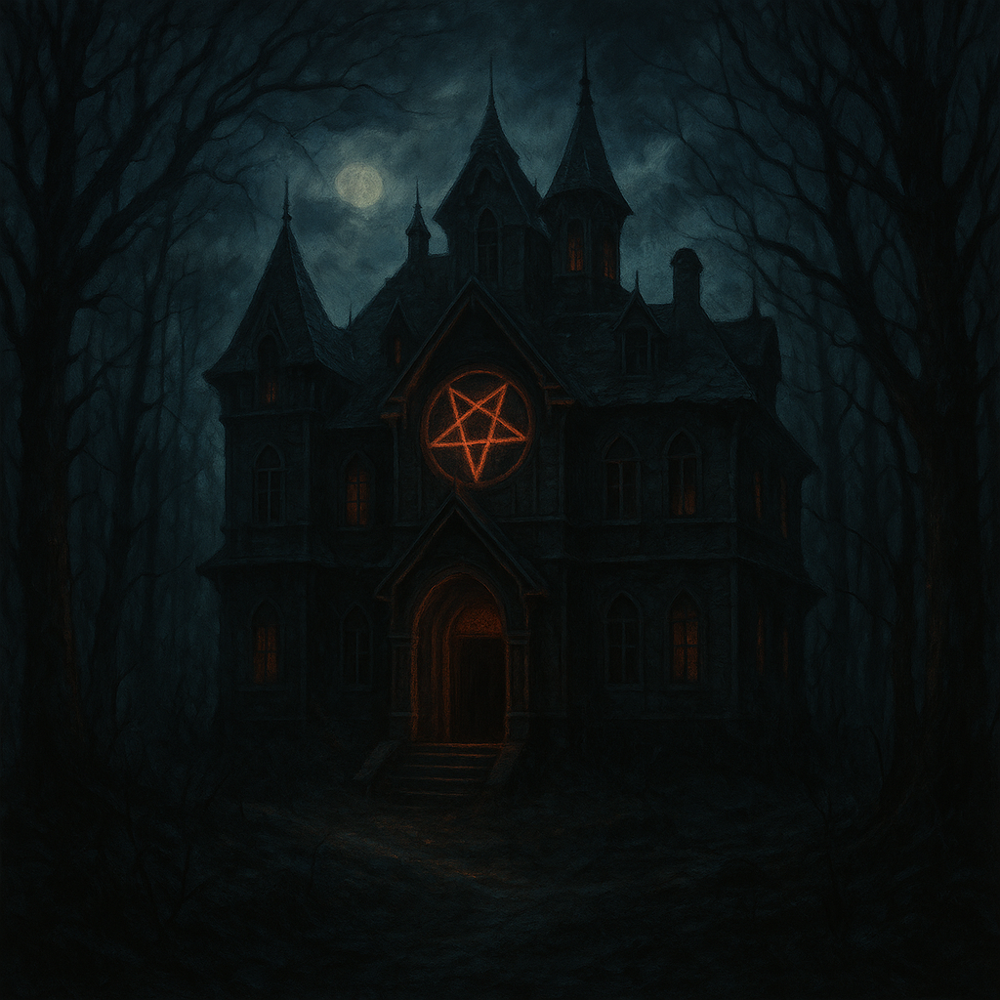

# ForbiddenRituals

---
### Game description
Forbidden Rituals is a survival horror game about forgotten rituals and the greedy people who found them. Players must unravel the mystery of the rituals and turn them before the evil gets out.

---
### Project lifetime
The game is currently in early development, meaning that only the initial concept of the game exists and many planned features have not yet been implemented. Once the MVP is achieved, development will be paused until either funding is secured or the developer has more free time.

---
### Main Game Features
- [ ] Creepy occult atmosphere
- [ ] Supernatural enemies and phenomena
- [ ] A wide variety of ways to fight enemies
- [ ] Escape from the immortal beasts
- [ ] Mysterious riddles and puzzles solving
- [ ] Single player mode
- [ ] Multiplayer mode

---
### MVP Features
##### Common
- [ ] Creepy occult atmosphere
- [ ] Escape from the immortal beasts
- [ ] Multiplayer mode
##### Quests
- [ ] Escape from the occultist's mansion
##### Enemies
- [ ] Zombie
- [ ] Immortal demon
##### Weapons
- [ ] Knife
- [ ] Gun
##### Game mechanics
- [ ] Pursuit
- [ ] Hide and seek
- [ ] Sprinting
- [ ] Enemies grip breaking
- [ ] Shelter zones
- [ ] Door keys finding
- [ ] Inventory
- [ ] Box-packed loot
- [ ] Weapon aiming
- [ ] Weapon reloadiong

---
### Development info
- Engine: Unity 6
- Multiplayer synchronization: Photon Engine
- Dependency injection: Zenject
